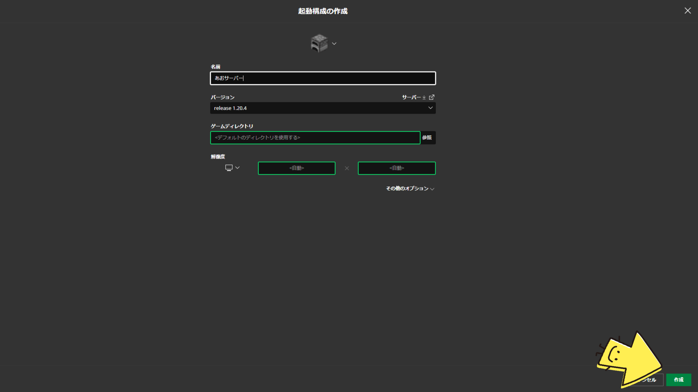
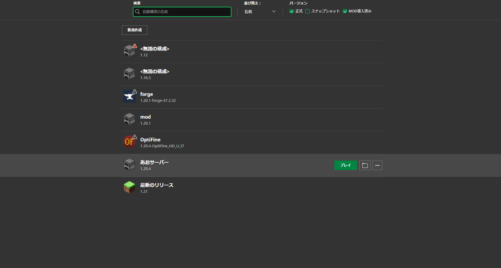

# マイクラサーバーへの接続方法

**バージョン変更**
まずは、マインクラフトのバージョンを変更します。

1. 起動構成という項目をクリックしてください。

2. するとこのような画面になります。そこで新規作成という項目をクリックします。

3.バージョンという項目のところでバージョンを選択します。※おすすめバージョンは1.20.4です。

4.名前もわかりやすいものに設定したら作成というところを押します。

5.そして今作ったマイクラのバージョンでプレイというところを押します。
